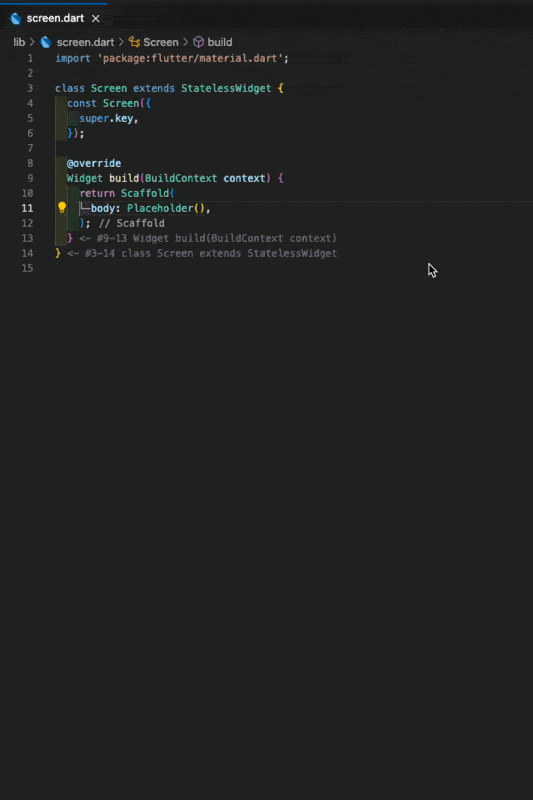

# Widget Wrapper

## Features
- Wrap with common Flutter widgets: Simplify your workflow by quickly wrapping widgets with frequently used Flutter widgets such as:
- Stack
- Expanded
- Flexible
- ColoredBox
- Align
- ConstrainedBox
- Code Actions Integration: Use the ⌘ + . (Mac) or Ctrl + . (Windows/Linux) shortcut to access the wrapper menu directly in the code actions menu.
- Quick Pick Menu: Easily access all available wrap options through a quick pick menu (command palette).
- Default Configurations: Each widget comes with sensible default values (e.g., Align defaults to Alignment.center, ColoredBox defaults to Colors.blue).

## How to Use
1. Place your cursor inside a Flutter widget in your code.
2. Press ⌘ + . (Mac) or Ctrl + . (Windows/Linux) to open the code actions menu.
3. Select “Flutter Widget Wrapper” from the menu.
4. Choose the desired widget to wrap with from the presented list.

## Tips for Using ⌘ + . (Mac) or Ctrl + . (Windows/Linux)
- To Remove a Widget:
After pressing ⌘ + . or Ctrl + ., you can quickly jump to the “Remove Widget” action by typing R.
- To Wrap with a Widget:
Similarly, you can quickly jump to the “Wrap with Widget” options by typing W after opening the code actions menu.

> [!NOTE]
> This functionality is provided by the official Flutter Extension, not by this extension.
>  However, it can be used seamlessly alongside this extension to improve your workflow.
